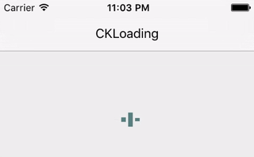
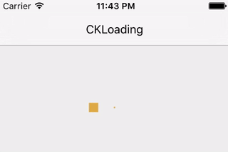

# CKLoadingView
🎤 Fully customized animatable iOS Loading view.

  
  
  

# Installation

## Pod

    pod 'CKLoadingView'
  
## Manually

Drag 'CKLoadingView.h' and 'CKLoadingView.m' to your project

# Usage

## Initialize with storyboard

### 1. Create a `CKLoadingView`
You can leverage storyboard to create a CKLoadingView, simply drag a `UIView` to the storybaord, and making that view subclass of `CKLoadingView`. And then make a IBOutlet to the controller:

    @property (weak, nonatomic) IBOutlet CKLoadingView *circleLoadingView;

### 2. Setup the properties for `CKLoadingView`

All the properties are initialized with default value automatically, so you can let them unchange, and it will work with default behaviour.

For __simple usage case__, you can call `startAnimate` to begin animation:

    [_circleLoadingView startAnimate];

For __advanced usage__, please refer the properties description below or the `Example` project:

Setup The signle loading item's width

    _circleLoadingView.itemWidth = 20;

Setup The margin between two loading item

    _circleLoadingView.itemMargin = _circleLoadingView.itemWidth * 0.3;

Setup The animation speed (unit: second)

    _circleLoadingView.animationSpeed = 0.8;

Setup The loading item's shape

    _circleLoadingView.loadingShape = CKLoadingShapeCircle;
    

Setup The loading items's color

    _circleLoadingView.loadingColor = [UIColor colorWithRed:.8 green:.34 blue:.31 alpha:1];

Wait for 2.0 seconds when one group of animation finished

    _circleLoadingView.animationStopWaitInterval = 2.0;

The succeeding loading item animation will be began with `_circleLoadingView.animationSpeed * 0.3` seconds after the proceeding loading item animation began.

    _circleLoadingView.animationItemDelayInterval = _circleLoadingView.animationSpeed * 0.3;

The loading item's target alpha value when animation end. Please note the animation will be reverse back, so the alpha animation will be:  1.0 ----> 0.3 ---> 1.0

    _circleLoadingView.animateToAlpha = 0.3;

Trigger loading view to start animation

    [_circleLoadingView startAnimate];

Stop animation

    [_circleLoadingView stopAnimate];

## Programmatically Initialize

    @property (nonatomic) CKLoadingView *circleLoadingView;
    
    _rectLoadingView = [[CKLoadingView alloc] initWithFrame:CGRectMake(0, 100, CGRectGetWidth([UIScreen mainScreen].bounds), 200)];
    _rectLoadingView.loadingShape = CKLoadingShapeRectangle;
    [self.view addSubview:_rectLoadingView];
    
    // Trigger loading view to start animation
    [_rectLoadingView startAnimate];
    
    // Stop animation
    [_rectLoadingView stopAnimate];
